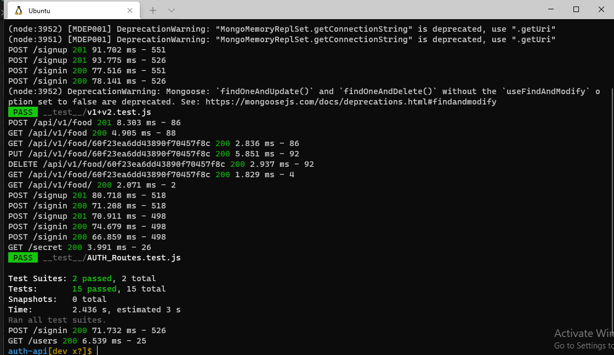
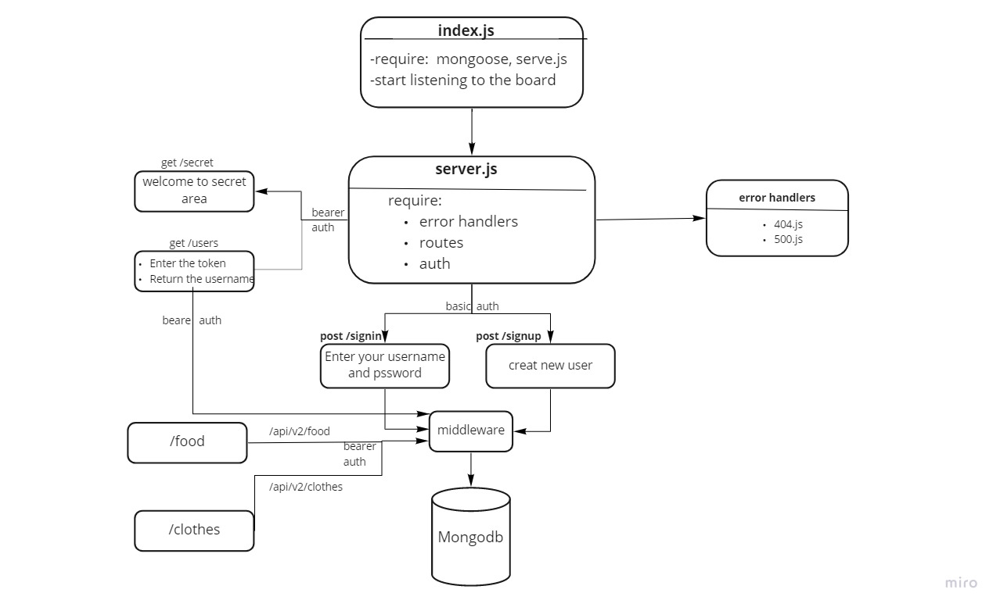

# Auth-Api

[Pull Request](https://github.com/En-ZUH/auth-api/pulls)

[Action](https://github.com/En-ZUH/auth-api/actions)

## Installation
* **dependencies :**
  * "@code-fellows/supergoose"
  * "base-64"
  * "bcrypt"
  * "cors"
  * "dotenv"
  * "express"
  * "jsonwebtoken"
  * "mongoose"
  * "morgan"
* **devDependencies :**
  * eslint"
  * "jest"
  * "supertest"
## **Setup**
* .env requirements
  * **PORT** - 5500
  * **MONGOOSE_URI**
  * **SECRET** - used to create jwt
## **Running the app**
* **npm start**
* **Endpoints:**
   *
   *  for create (/signup)
   *  for login (/signin)
   *  for get (/users)
   *  for create(/api/v1/food||clothes)
   *  for update(/api/v1/food||clothes)
   *  for delete(/api/v1/food||clothes)
## **Tests**
* **Unit Tests:** npm run test (tests for server, routes, and user model currently implemented):
  * Auth Router
    * admin users
      * ✓ can create one 
      * ✓ can signin with basic 
      * ✓ can signin with bearer 
    * bad logins
      * ✓ POST /api/v1/:model adds an item to the DB and returns an object with the added item 
      * ✓ GET /api/v1/:model returns a list of :model items
      * ✓ GET /api/v1/:model/ID returns a single item by ID
      * ✓ PUT /api/v1/:model/ID returns a single, updated item by ID  
      * ✓ DELETE /api/v1/:model/ID returns an empty object. Subsequent GET for the same ID should result in nothing found 
     
    * editor users
      * ✓ can create one 
      * ✓ can signin with basic 
      * ✓ can signin with bearer 
    * user users
      * ✓ can create one 
      * ✓ can signin with basic 
      * ✓ can signin with bearer 
 
## Testing: npm test

***
##  UML Diagram 

